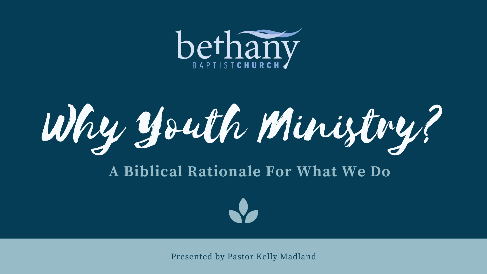

[notes]
This presentation is for the class:
<ins>Thinking Theologically About Youth Ministry</ins>
 Professor: Rev. Dr. Chap Clark
 The Coalition for Youth Ministry Excellence
 July 10, 2020
 
 
Youth Ministry is a staple program in the modern Church, but have you ever thought about WHY it exists as a program? Just because something has always been done a certain way, doesn't necessarily mean it should continue. Hopefully, by the power of the Holy Spirit, we will be constantly re-evaluating how we do church up and against God's Word. Is there a Biblical reason for providing youth ministry?
[/notes]

---

[notes]
Jesus. That's it. Thank you for coming and have a great day.
 
 
But seriously, everything we DO at Bethany Student Ministries is aimed at pointing students to Jesus.
 
  (next slide)
[/notes]

---

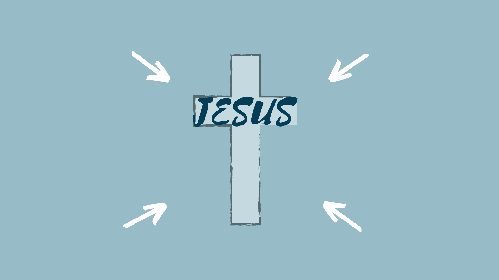

[notes]
He is our centre...our reason for existing as a church and as a youth ministry. If he wasn't, we would simply be a community centre at best.
 
 
(next slide)
[/notes]

---

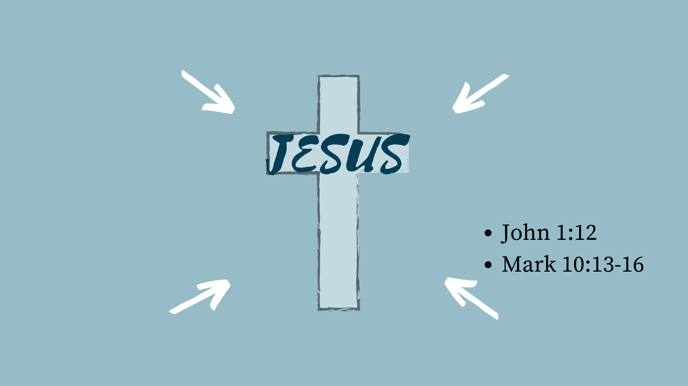

[notes]
If Jesus is at the centre, this has implications for what we do. If that is the case, we should take a look at who he is. What is his heart?
  get into groups of 3-6
  Read the 2 passages on the slide and discuss the following question:
 
  What are the implications for youth ministry? (5-10 minutes)
 
  Come back and share highlights from each groups
  From John 1:12 draw out - we all have the right to be children of God/we are all part of one family.
 
  From Mark 10:13-16 draw out - Sometimes the church at large and also the rest of society hinders youth from being a part of the family of God - we see this with the Nones, Gones - youth and young adults who are leaving the church in droves. As a youth ministry we need to stop being part of the problem and start being a bridge into full acceptance into the family of God - the church.
 
 
(next slide)
[/notes]

---

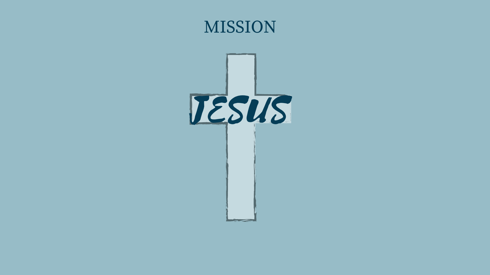

[notes]
So what is our mission?
 
 
As we just read, anyone who believes and accepts Jesus is a child of God - so we are all his children and we are all part of his family, no matter what age.
  Therefore Youth Ministry is a part of the larger church, and we need to function, not as a silo unto ourselves, but as a bridge for students to be part of the whole. If that is the case, our mission should be the same as the whole church...and in fact, some youth leaders agreed upon this at the last visioning meeting.
 
 
Does anyone know the church's mission statement...which is our youth ministry mission statement as well?
 
 
(next slide)
[/notes]

---

[notes]
What things are implied by this mission statement?
 
  draw out - Got's story offered to be ours (redemption).
  - Discipling - we journey together.
  the old has gone the NEW has come.
  etc.
 
 
(next slide)
[/notes]

---

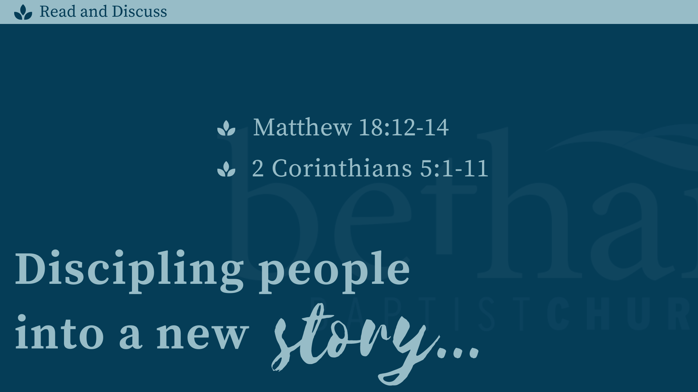

[notes]
Groups of 3-6 to read and discuss the following questions:  How do you think these passages apply to Youth Ministry?   what is at stake?   What do you think is our responsibility/privilege as a child of God?   how does all of this fit or not fit with our mission statement? (5-10 minutes)
 
  Come back to large group & share highlights
  Draw out/ask
- can the illustration of the lost sheep apply to a group of people; ie, youth, black people? Why or why not?  
- our responsibility is to please the Lord - what things please the Lord? Can you use scripture to answer? (ie, helping rescue a lost sheep, cup of water, Micah 6:8, etc)
  Is youth ministry/ the goal of our mission statement a good thing that would please the Lord? Is this something you would love to stand before the Lord one day and show him you have done?
 
 
(next slide)
[/notes]

---

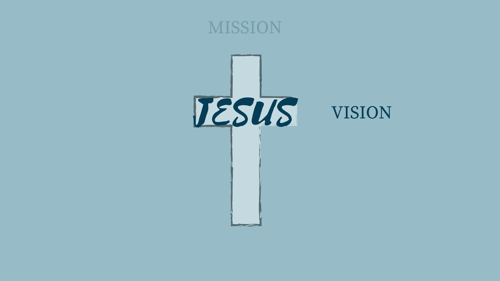

[notes]
If our mission, then, is to disciple youth into a new story, we need a vision of how to do that.
 
 
In order to develop a vision of how to do youth ministry, we should learn a little bit about youth and what they are dealing with, and what they need. We can't make them believe in Jesus or heal them from hurts or make them choose good choices as well as involvement in church. But we can work towards learning who they are and what they need so we can create an environment that opens doors for those things to be able to happen. So what do the youth of today need?
 
 
(next slide)
[/notes]

---

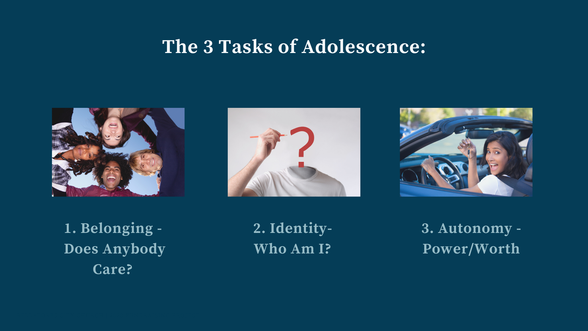

[notes]
Dr. Chap Clark suggests in his book Adoptive Church, that there are 3 tasks of adolescence:  
 
<ul>
1. Belonging      
2. Identity     
3. Autonomy  
</ul>
 
With belonging, adolescence want a place/community to belong that is bigger than themselves. This is so great because we can introduce God's Story to them - the overarching story of mankind and God's fight to redeem it is a story much bigger than each of them, and yet they are intimately a part of it and God has written a part specifically for them. Kids need to know that they are loved and supported beyond their own families - especially kids where their families are not a safe or supportive place.
 
  Identity is about figuring out who they are becoming and who they want to be. That is why it can seem they change from week to week. It is a time of experimentation and walking that journey. It is such a great time to help them know that their identity can be found in Christ as opposed to so many other things that vie for their allegiance.  
 
 Autonomy is about wanting a voice. They want increased control over their own lives. They are looking for and desiring increased independence and purpose. We have the ability in youth ministry to be able to help them with all of those things!
 
  In line with our mission statement and in response to these needs or tasks of adolescence,  our vision for youth ministry is as follows:
 
 
(next slide)

[/notes]

---

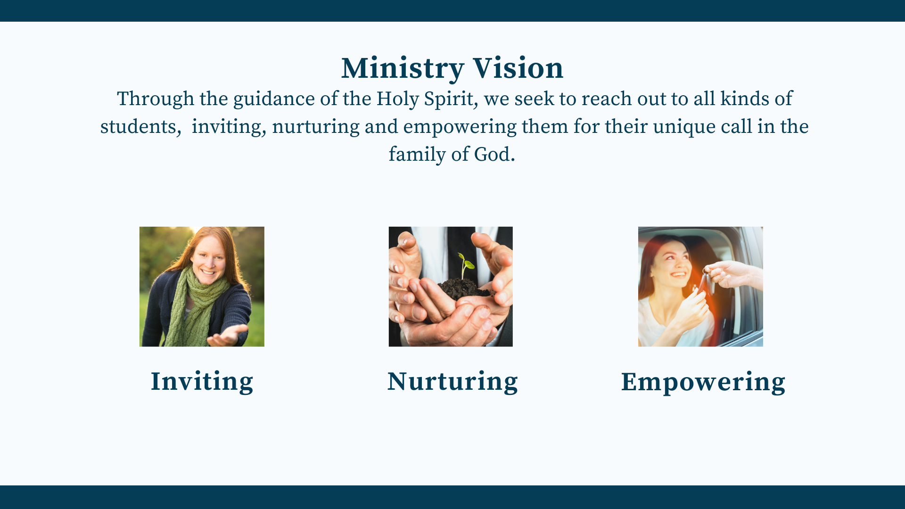

[notes]
hello how are you? This is where I write my notes.
[/notes]

---

[notes]
hello how are you? This is where I write my notes.
[/notes]

---

[notes]
hello how are you? This is where I write my notes.
[/notes]

---

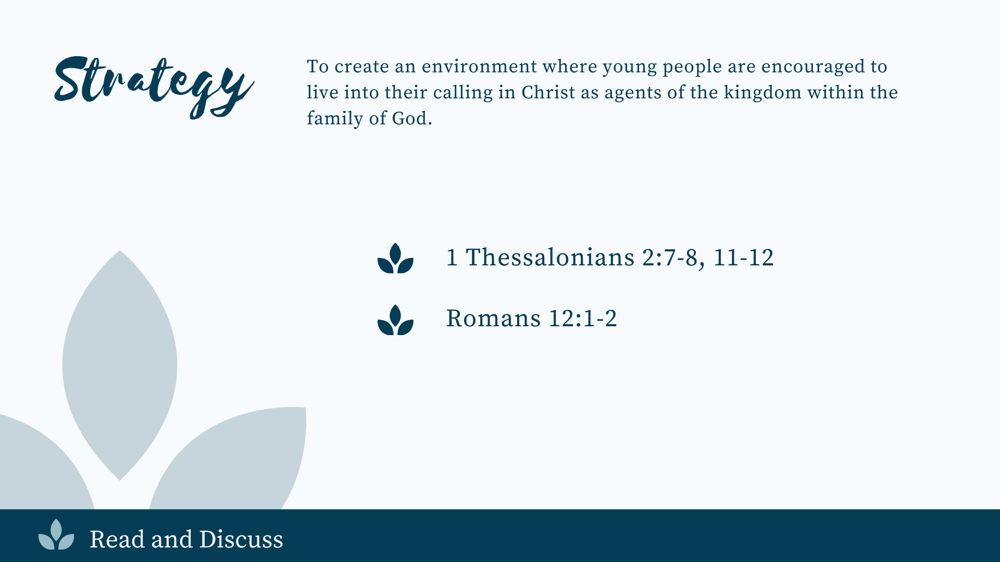

[notes]
hello how are you? This is where I write my notes.
[/notes]

---

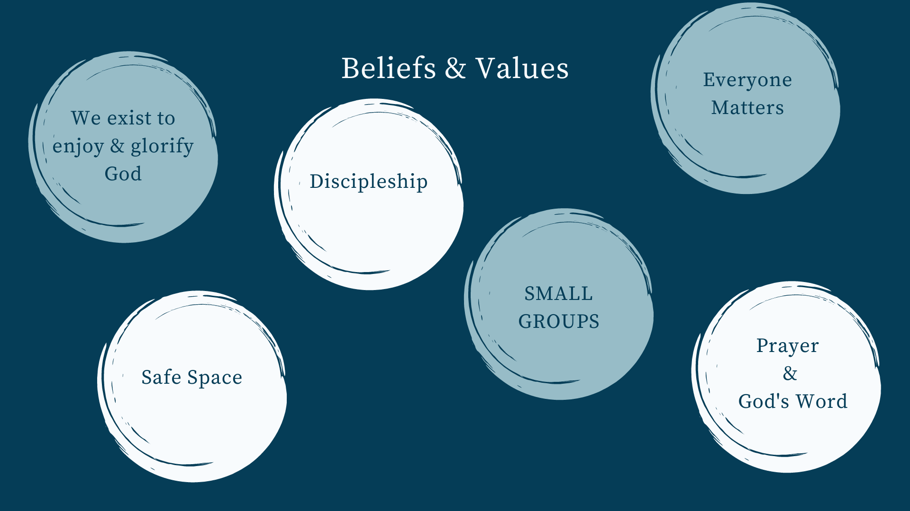

[notes]
hello how are you? This is where I write my notes.
[/notes]

---

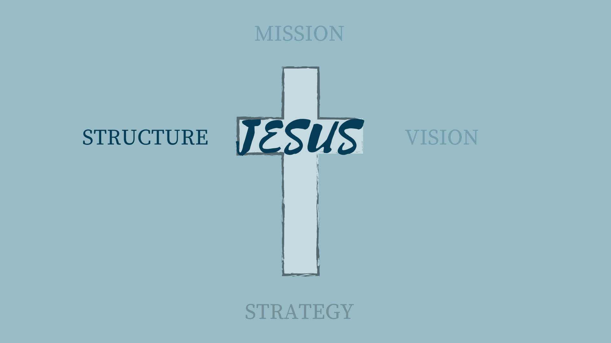

[notes]
hello how are you? This is where I write my notes.
[/notes]

---

[notes]
hello how are you? This is where I write my notes.
[/notes]

---

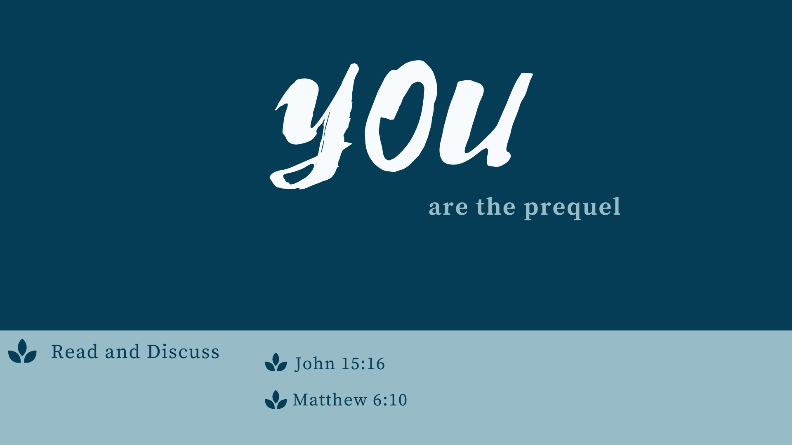

[notes]
hello how are you? This is where I write my notes.
[/notes]

---

[notes]
hello how are you? This is where I write my notes.
[/notes]

---

[notes]
hello how are you? This is where I write my notes.
[/notes]

---

[notes]
hello how are you? This is where I write my notes.
[/notes]

---

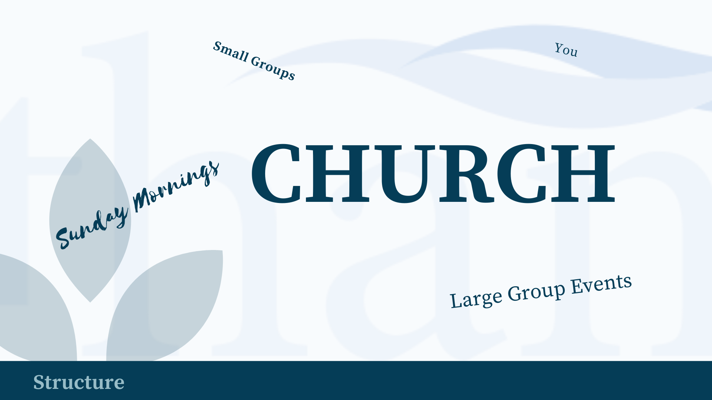

[notes]
hello how are you? This is where I write my notes.
[/notes]

---

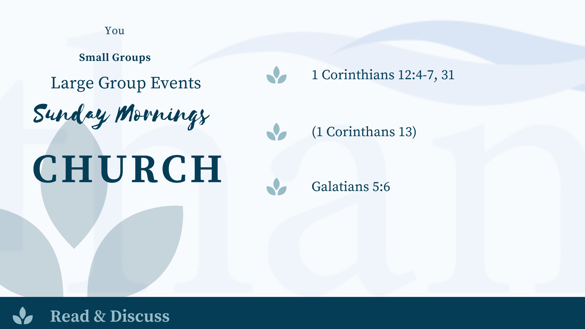

[notes]
hello how are you? This is where I write my notes.
[/notes]

---

[notes]
hello how are you? This is where I write my notes.
[/notes]

---

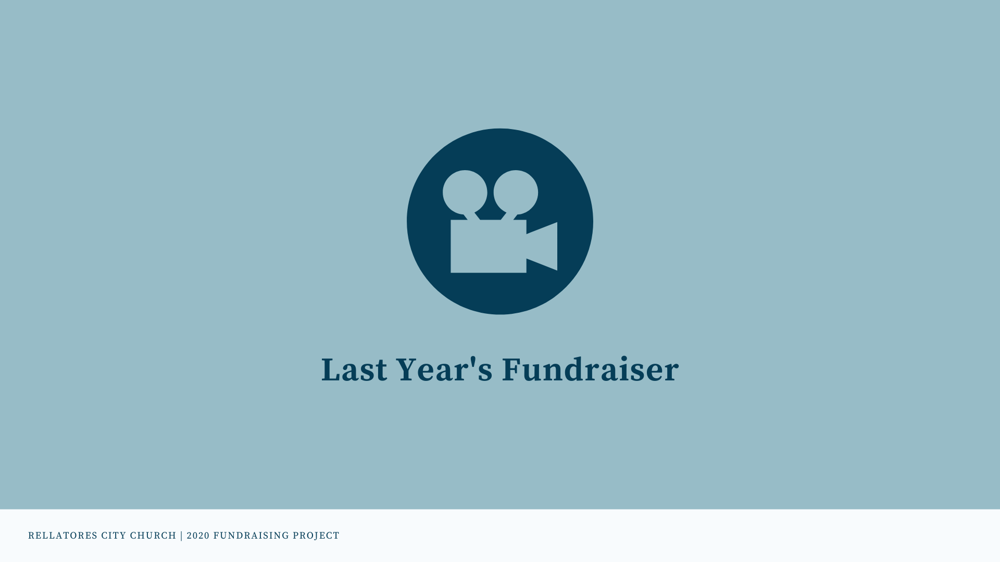

[notes]
hello how are you? This is where I write my notes.
[/notes]

---

[notes]
hello how are you? This is where I write my notes.
[/notes]

---

[.text: alignment(center)]

# CPT 363

### Slides Placeholder

> “A work in progress. And the possibilities are endless.”
-- Elizabeth Eulberg

---

[.background-color: #FFFFFF]

---
