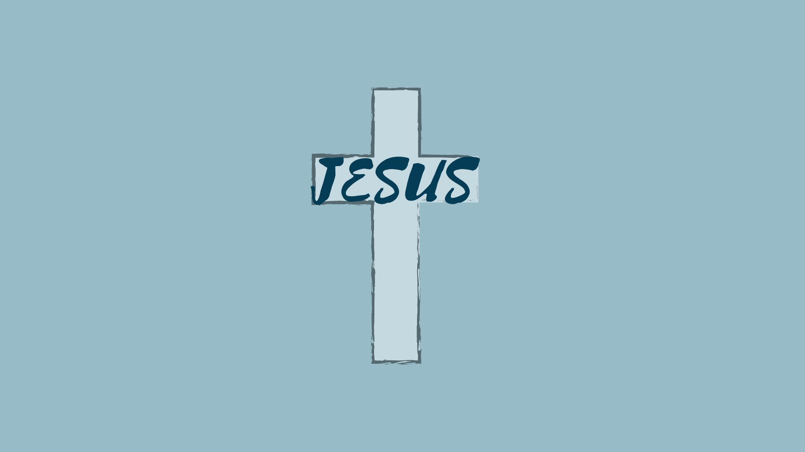
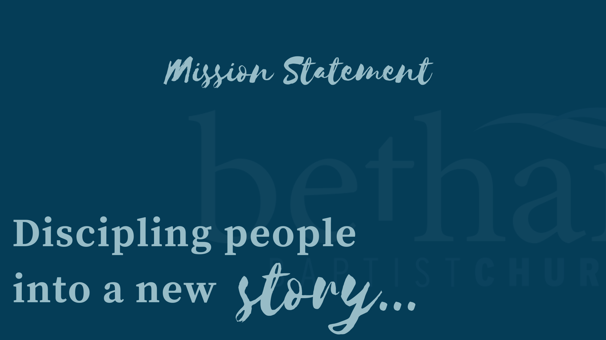
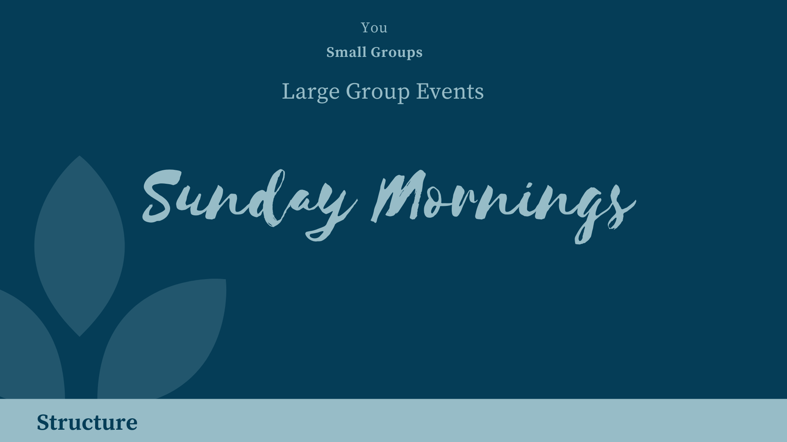
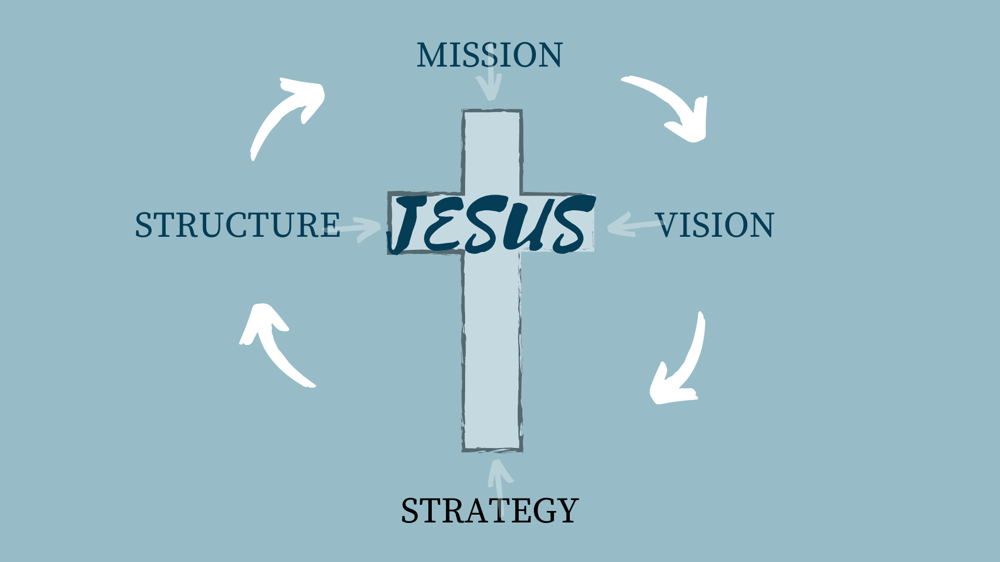

[notes]
hello how are you? This is where I write my notes.
[/notes]

---

[notes]
hello how are you? This is where I write my notes.
[/notes]

---

[notes]
hello how are you? This is where I write my notes.
[/notes]

---

[notes]
hello how are you? This is where I write my notes.
[/notes]

---

[notes]
hello how are you? This is where I write my notes.
[/notes]

---

[notes]
hello how are you? This is where I write my notes.
[/notes]

---

[notes]
hello how are you? This is where I write my notes.
[/notes]

---

[notes]
hello how are you? This is where I write my notes.
[/notes]

---

[notes]
hello how are you? This is where I write my notes.
[/notes]

---

[notes]
hello how are you? This is where I write my notes.
[/notes]

---

[notes]
hello how are you? This is where I write my notes.
[/notes]

---

[notes]
hello how are you? This is where I write my notes.
[/notes]

---

[notes]
hello how are you? This is where I write my notes.
[/notes]

---

[notes]
hello how are you? This is where I write my notes.
[/notes]

---

[notes]
hello how are you? This is where I write my notes.
[/notes]

---

[notes]
hello how are you? This is where I write my notes.
[/notes]

---

[notes]
hello how are you? This is where I write my notes.
[/notes]

---

[notes]
hello how are you? This is where I write my notes.
[/notes]

---

[notes]
hello how are you? This is where I write my notes.
[/notes]

---

[notes]
hello how are you? This is where I write my notes.
[/notes]

---

[notes]
hello how are you? This is where I write my notes.
[/notes]

---

[notes]
hello how are you? This is where I write my notes.
[/notes]

---

[notes]
hello how are you? This is where I write my notes.
[/notes]

---

[notes]
hello how are you? This is where I write my notes.
[/notes]

---

[notes]
hello how are you? This is where I write my notes.
[/notes]

---

[.text: alignment(center)]

# CPT 363

### Slides Placeholder

> “A work in progress. And the possibilities are endless.”
-- Elizabeth Eulberg

---

[.background-color: #FFFFFF]

---

[youtube]https://www.youtube.com/watch?v=Nj6x01wg2WA[/youtube]

---

[.background-color: #618B25]
[.build-lists: true]

# Topics to Explore
1. Topic One  
2. Topic Two   
3. Topic Three  

[notes]

These are my notes.

[/notes]
---

[.background-color: #611036]

# Slides Placeholder

### [fa=fa-rocket] Topic One

---

[.background-color: #611036]

# Slides Placeholder

### [fa=fa-rocket] Topic Two

---

[.background-color: #611036]

# Slides Placeholder

### [fa=fa-rocket] Topic Three

---

[.background-color: #618B25]

# Summary
1. Topic One  
2. Topic Two   
3. Topic Three  

---
