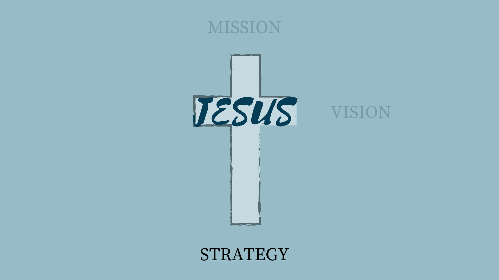

[notes]
This presentation is for the class:
<ins>Thinking Theologically About Youth Ministry</ins>
 Professor: Rev. Dr. Chap Clark
 The Coalition for Youth Ministry Excellence
 July 10, 2020
 
 
Youth Ministry is a staple program in the modern Church, but have you ever thought about WHY it exists as a program? Just because something has always been done a certain way, doesn't necessarily mean it should continue. Hopefully, by the power of the Holy Spirit, we will be constantly re-evaluating how we do church up and against God's Word. Is there a Biblical reason for providing youth ministry?
[/notes]

---

[notes]
Jesus. That's it. Thank you for coming and have a great day.
 
 
But seriously, everything we DO at Bethany Student Ministries is aimed at pointing students to Jesus.
 
  (next slide)
[/notes]

---

[notes]
He is our centre...our reason for existing as a church and as a youth ministry. If he wasn't, we would simply be a community centre at best.
 
 
(next slide)
[/notes]

---

[notes]
If Jesus is at the centre, this has implications for what we do. If that is the case, we should take a look at who he is. What is his heart?
  get into groups of 3-6
  Read the 2 passages on the slide and discuss the following question:
 
  What are the implications for youth ministry? (5-10 minutes)
 
  Come back and share highlights from each groups
  From John 1:12 draw out - we all have the right to be children of God/we are all part of one family.
 
  From Mark 10:13-16 draw out - Sometimes the church at large and also the rest of society hinders youth from being a part of the family of God - we see this with the Nones, Gones - youth and young adults who are leaving the church in droves. As a youth ministry we need to stop being part of the problem and start being a bridge into full acceptance into the family of God - the church.
 
 
(next slide)
[/notes]

---

[notes]
So what is our mission?
 
 
As we just read, anyone who believes and accepts Jesus is a child of God - so we are all his children and we are all part of his family, no matter what age.
  Therefore Youth Ministry is a part of the larger church, and we need to function, not as a silo unto ourselves, but as a bridge for students to be part of the whole. If that is the case, our mission should be the same as the whole church...and in fact, some youth leaders agreed upon this at the last visioning meeting.
 
 
Does anyone know the church's mission statement...which is our youth ministry mission statement as well?
 
 
(next slide)
[/notes]

---

[notes]
What things are implied by this mission statement?
 
  draw out - Got's story offered to be ours (redemption).
  - Discipling - we journey together.
  the old has gone the NEW has come.
  etc.
 
 
(next slide)
[/notes]

---

[notes]
Groups of 3-6 to read and discuss the following questions:  How do you think these passages apply to Youth Ministry?   what is at stake?   What do you think is our responsibility/privilege as a child of God?   how does all of this fit or not fit with our mission statement? (5-10 minutes)
 
  Come back to large group & share highlights
  Draw out/ask
- can the illustration of the lost sheep apply to a group of people; ie, youth, black people? Why or why not?  
- our responsibility is to please the Lord - what things please the Lord? Can you use scripture to answer? (ie, helping rescue a lost sheep, cup of water, Micah 6:8, etc)
  Is youth ministry/ the goal of our mission statement a good thing that would please the Lord? Is this something you would love to stand before the Lord one day and show him you have done?
 
 
(next slide)
[/notes]

---

[notes]
If our mission, then, is to disciple youth into a new story, we need a vision of how to do that.
 
 
In order to develop a vision of how to do youth ministry, we should learn a little bit about youth and what they are dealing with, and what they need. We can't make them believe in Jesus or heal them from hurts or make them choose good choices as well as involvement in church. But we can work towards learning who they are and what they need so we can create an environment that opens doors for those things to be able to happen. So what do the youth of today need?
 
 
(next slide)
[/notes]

---

[notes]
Dr. Chap Clark suggests in his book Adoptive Church, that there are 3 tasks of adolescence:  
 
<ul>
1. Belonging           
2. Identity          
3. Autonomy       
</ul>
 
 
With belonging, adolescence want a place/community to belong that is bigger than themselves. This is so great because we can introduce God's Story to them - the overarching story of mankind and God's fight to redeem it is a story much bigger than each of them, and yet they are intimately a part of it and God has written a part specifically for them. Kids need to know that they are loved and supported beyond their own families - especially kids where their families are not a safe or supportive place.
 
  Identity is about figuring out who they are becoming and who they want to be. That is why it can seem they change from week to week. It is a time of experimentation and walking that journey. It is such a great time to help them know that their identity can be found in Christ as opposed to so many other things that vie for their allegiance.  
 
 Autonomy is about wanting a voice. They want increased control over their own lives. They are looking for and desiring increased independence and purpose. We have the ability in youth ministry to be able to help them with all of those things!
 
  In line with our mission statement and in response to these needs or tasks of adolescence,  our vision for youth ministry is as follows:
 
 
(next slide)

[/notes]

---

[notes]
(read the vision aloud)     
As you can see, the vision of how to do youth ministry, and who we aim to be, is borne out of the needs of adolescents from the previous slide.    
Because they need to feel that they belong to something greater than themselves, we want to be *inviting*. Our church's vision uses the word "winning", but I feel that winning implies an agenda on our part. It comes from good intentions - we want to win souls for Christ. But our culture has changed and sometimes these old illustrations come to have different meanings. Winning also implies competition and achievement. Youth can smell inauthenticity and personal agendas a mile away. The bait and switch method of evangelism should be avoided at all costs. Kids need a place to belong, to be loved; a place of warmth and safety. The rest of the world is cold and they feel it is against them. We want youth group to be a place where they can be welcomed just as they are, welcomed with a smile, and a place where they can find community. Out of that will come the fun and a chance to BE the gospel to them and share it verbally with them out of the truth we are living.     
Because adolescents need to figure out who they are, we want to be a *nurturing* community. Bethany's vision statement says the word "equipping", but again, because the world is a different place for youth than it was 10 and 20 years ago or more, we need to change the nature of how we approach ministry. Equipping is part of nurturing, and we certainly want to continue with helping them engage with God's word, allowing them space to ask tough questions without judgment. We want to walk with them on their journeys through thick and thin by making small groups a central part of what we do. But we want to do this thoughtfully, and carefully, with warmth and real care and concern. This isn't just putting in time to earn brownie points with God. This is about real relationships, about being family - God's family.     
And finally, because adolescents need autonomy - a sense of power and worth, we want to be able to hand them the keys to that, so to speak. We want to be *empowering* in youth ministry. We want to help each student find and develop the gifts God has given them. This is done by mentoring via small groups, service opportunities inside and outside of church, as well as listening to their ideas and fanning their flame to implement them. The beauty of this is that it helps them figure out who they are as well as gives them a sense of belonging.     
 
(next slide)
[/notes]

---

[notes]
We need a strategy, then, for implementing our Mission and Vision for the church and for the youth ministry. How do we go about accomplishing these things?
 
 
(next slide)

[/notes]

---

[notes]
We want to create an environment where young people are encouraged to live into their calling in Christ as agents of the kingdom with the family of God.   
 
For starters, We want a kid to be greeted with a smile and by name when they walk in the door. We want to aim for an overall ethos of warmth. Kids are arriving anxious about being accepted, about all the things going on at home, at school, etc. They need to sense they are wanted here and that they are safe.   
 
Then we want to get to know them in small groups, build relationships and good memories: we want to share our lives with them so we can be there to listen, learn about them, and earn the right to speak into their lives.   
 

(next slide)

[/notes]

---

[notes]
Once again, get into groups of 3-6 and read and discuss the following questions in light of the scriptures on the slide:  
   
<ul>  
1. What about this strategy to you agree with and what do you disagree with?   
 
2. As a youth leader/small group leader and in light of these scriptures, what do you see as your responsibility?     
</ul>
 
 
gather back in a large group and share highlights   
 
Draw out - paul shared his life with the Thessalonians as a family member - and then had the right to speak into their lives because it was based on established trust and love.
  
 
That takes time and commitment and sacrifice. (However, it also does not mean having zero boundaries - but that is another seminar).     
 
 (next slide)
[/notes]

---

[notes]
The beliefs and values that the youth ministries team came up with also plays heavily into our strategy. You can find these on my website, docs.thinkclearly.ca    
 
**We believe that we exist to enjoy God and glorify Him**  We love to have fun at Bethany Student Ministries, but we have fun that is filled with purpose. We are not a ministry that runs events for the sake of simply occupying students. We run events to reflect God's love, to teach about him and his Good News, and to glorify him, *while having fun*. We want our speech, our lives and how we love others to reflect God and be a witness for him. There fore, we will strive to have JOY-by putting Jesus first, others second and ourselves third.     
 
**We believe that everyone matters**  Because every person is made in God's image, that means He knows who they are and He loves them. He sent his son to die for them and sees each person and infinitely valuable and precious. Thus, we need to see them that way too! So regardless of size, age, colour, gender, body odour or odd behaviour, every person matters and needs to be treated with dignity. Every person should have the opportunity to hear about their Maker, how much he loves them, and to what extent he has already gone to reconnect with them.   
 
**We believe in being a safe space**  Because every student who walks through that door matters, we want them to feel safe and welcome. Bethany Student Ministries needs to be a place they can call their own; a place that they want to return to. We will not tolerate bullying in any form. Confidentiality will be respected as long as no imminent harm will come to a student or someone else. Asking tough  questions will be valued and not judged.     
 
**We believe in discipleship**  Our great mission, given by Jesus, was to go and make disciples, baptizing them and teaching them all about what God has taught us to do and be as his family. Disciples make disciples; so in all we do, we see to walk with students and help form them into disciples of Christ. We will create opportunities for learning, worshipping, participating in spiritual disciplines and service to others. Most of our students who are regular churchgoers serve in children's ministry, in the hospitality ministry or on the audiovisual team. As we learn of their gifts, we would also advocate for other opportunities.   
 
**We highly value small groups**  we value small group ministry, and seek to make use of it in discipleship and in fostering a sense of belonging, trust and security. Jesus modelled discipleship in this manner, therefore, we will attempt to do the same. The youth leaders are mentored by the youth pastor as a small group as well. They learn, study, pray, play and break bread together. Then the youth leaders mentor their specific small group in the youth ministry, ideally walking with them for as long as possible throughout their years in youth group.   
 
**We believe in being a people of prayer and of the Book**  We are on a journey of learning God's Story and how we are to live as part of his family in that story. We believe God's Word to be true and worthy of study. We believe it is living and active and therefore speaks to our lives an dhow to live them. We also believe that God speaks and listens to us. We will strive to be a people of prayer even thought we don't fully understand how it works, trusting the Holy Spirit and the Word of God to teach us. we will explore ways to express ourselves to God and ways to listen to Him.   
 
(next slide)
[/notes]

---

[notes]
So what is the structure of Bethany Student Ministries? What things do we do to actually accomplish this environment that we want to create?   
 

(next slide)
[/notes]

---

[notes]
You are actually the secret ingredient to the recipe of creating the environment at each event. You are the prequel to the main series of events. --This is why it is so wonderful that you want to (or are interested in) being a part of the youth ministry here at Bethany.-- So what do I mean by this?   
 

(next slide)
[/notes]

---

[notes]
(Groups of 3-6)   
For the John passage, make a note to read the verse on the slide, then read what come before; verses 5-17. Then reread verse 16.

After reading both passages, discuss what you think I mean by YOU being the prequel to every youth ministry gathering in light of those passages. What implications for your life arise from this? (5-10 min)   
 
Large group discussion highlights  
 
Draw out - You are an agent of God's kingdom - you are praying for God's kingdom to come, for his will to be done. As Christians, that is our hope and desire, yes?  
Therefore, if you are discipling others, you need to stay in Christ, in the vine. A plant that doesn't get watered or fed by something just shrivels and dies and isn't any good to anyone. It certainly isn't going to produce food for others or grow the main plant it is a part of any further. It is vital for you to have an active relationship with Christ - to remain in him, to be on your own journey in order to live by example for these kids. You aren't expected to have to do this all on your own, that is what our leader's small group is partly for. Another great resource for this are spiritual disciplines (journaling, or lectio divina or secret giving, or practicing the presence and so on - there are many to explore). These are a response to God's love for us, not a responsibility. Remember, Discipleship is an inside to outside endeavour. You can't make kids encounter God. That is the Holy Spirit's job. But we can show up, share ourselves and our journey authentically, listen to their stories. Then we will be able to invite kids to discover who they are as found children of the king.  It starts with you.  
 

(next slide)

[/notes]

---

[notes]
hello how are you? This is where I write my notes.
[/notes]

---

[notes]
hello how are you? This is where I write my notes.
[/notes]

---

[notes]
hello how are you? This is where I write my notes.
[/notes]

---

[notes]
hello how are you? This is where I write my notes.
[/notes]

---

[notes]
hello how are you? This is where I write my notes.
[/notes]

---

[notes]
hello how are you? This is where I write my notes.
[/notes]

---

[notes]
hello how are you? This is where I write my notes.
[/notes]

---

[notes]
hello how are you? This is where I write my notes.
[/notes]

---

[.text: alignment(center)]

# CPT 363

### Slides Placeholder

> “A work in progress. And the possibilities are endless.”
-- Elizabeth Eulberg

---

[.background-color: #FFFFFF]

---
